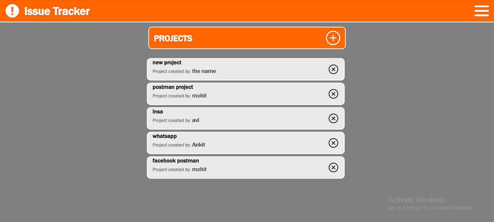
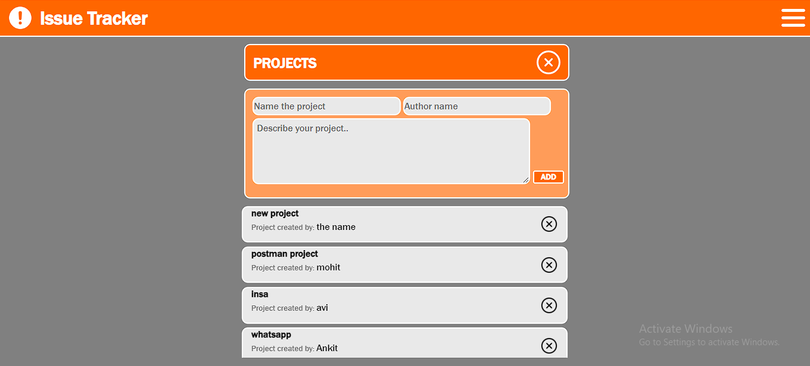
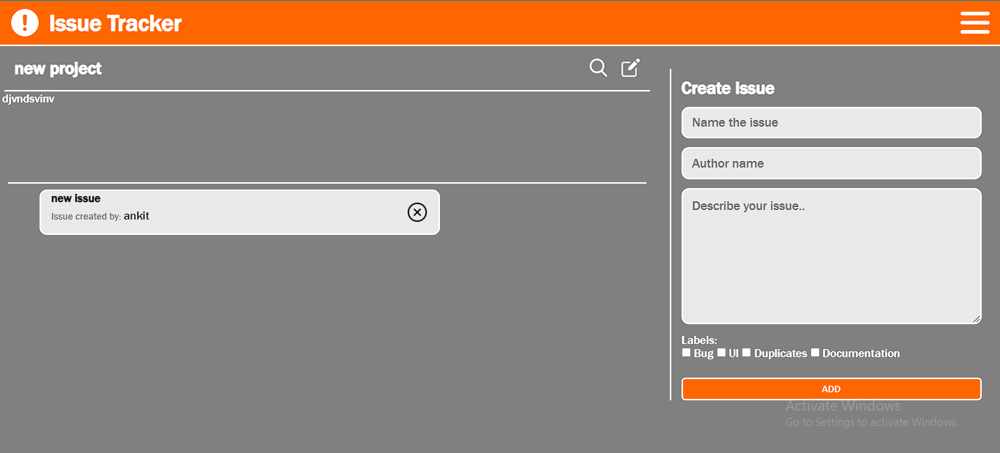
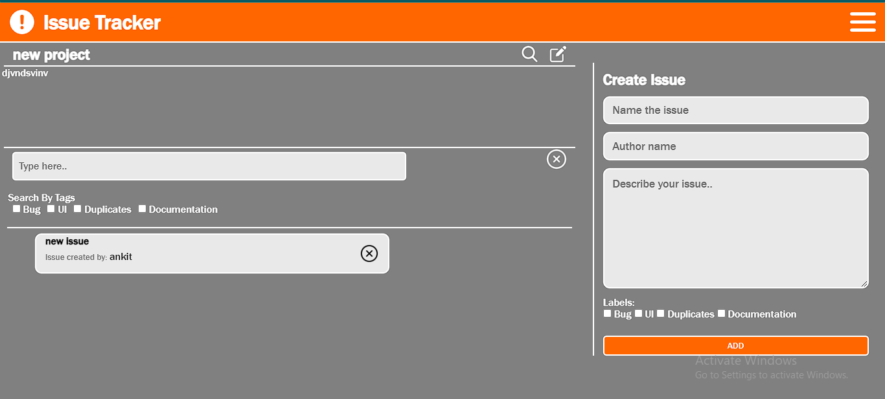
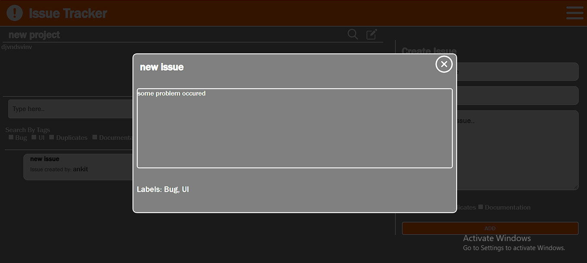

# Issue Tracker

The Issue Tracker is a web application that helps you keep track of various projects and their associated issues. It allows users to create projects, add issues to those projects, and manage them efficiently.

## Features

- Create and manage projects
- Add, edit, and delete issues associated with each project
- Assign labels to issues for better organization
- Search and filter issues by various criteria
- User-friendly interface for easy navigation

## Technologies Used

- Node.js
- Express.js
- MongoDB
- HTML, CSS, and JavaScript (Front-end)
- AJAX and Fetch API for asynchronous operations

## Installation

1. Clone this repository to your local machine.
2. Install the required dependencies using the following command:
- `npm install`
3. Set up your database configuration in the `config/mongoose.js` file.

## Usage

1. Start the server using the following command:
- `node index.js`

## API Endpoints

- **POST /projects/create**: Create a new project.
- **GET /projects/:id**: Get project details by ID.
- **GET /projects/**: Get  all projects.
- **PUT /projects/update/:id**: Update project details by ID.
- **DELETE /projects/destroy/:id**: Delete a project by ID.

- **POST /issues/create**: Create a new issue for a project.
- **GET /issues/:id**: Get issue details by ID.
- **GET /issues/:id**: Get all issues.
- **PUT /issues/update/:id**: Update issue details by ID.
- **DELETE /issues/destroy/:id**: Delete an issue by ID.

## Screenshots

